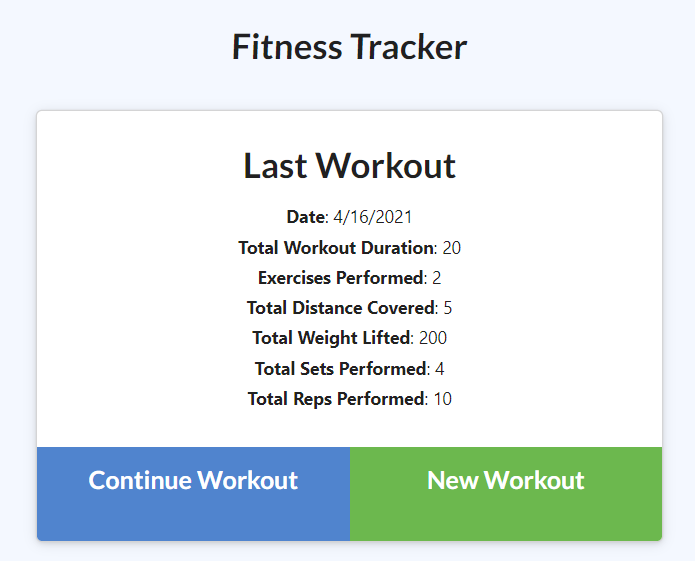
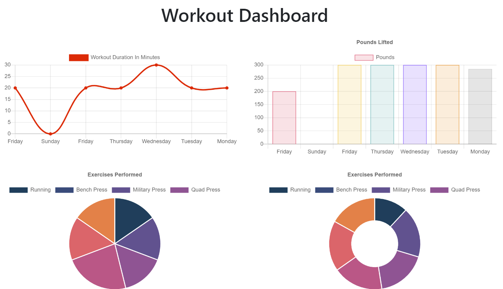

# workit

## Description

A daily workout tracker

-----

## Table of Contents

* [Installation](#installation)
* [Usage](#usage)
* [Links](#Links)
* [License](#license)
* [Questions](#questions)

-----

## Installation

To install locally, run ``npm i`` to install dependencies. ``npm start`` will launch the server.

You will also need a MongoDB instance. Configure the connection under server.js

## Usage

On loading the application, you will see a summary of your last workout. You can add exercises to the current workout with "Continue Workout", or start a new workout by clicking "New Workout"

Clicking "Dashboard" on the navigation bar will bring you to a visualization of your last 7 workouts. "Fitness Tracker" on the nav bar will return you to the home screen.

-----

## Links

[Github Repository](https://github.com/Athear/workit)

[Live application](https://workit-athear.herokuapp.com/)

  ## License

  Licensed under the [MIT](https://spdx.org/licenses/MIT.html) license.

## Questions

For additional questions, find me on [GitHub](https://github.com/Athear)

